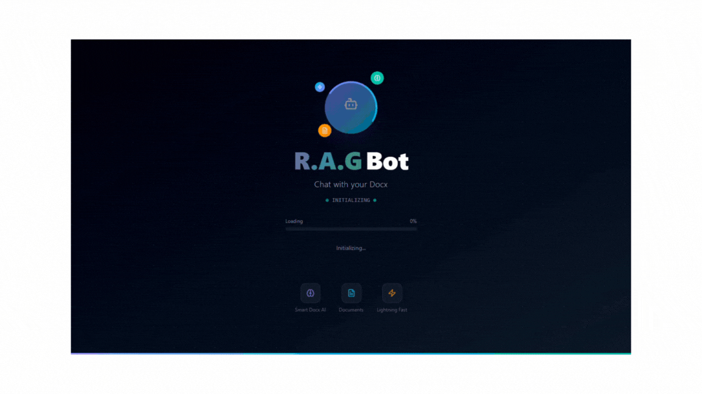

# The R.A.G Chatbot 

<div align="center">

[](https://nextjs.org/)
[](https://react.dev)
[](https://tailwindcss.com/)
[](https://supabase.com/)
[](https://www.framer.com/motion/)
[](https://www.typescriptlang.org/)

</div>

---

  
  

---

## ✨ Features  
- 📄 Upload PDFs / Docs / Text files  
- 💬 Chat with documents using **RAG + Gemini AI**  
- ⚡ Real-time streaming responses  
- 🎨 Beautiful UI built with **TailwindCSS, Lucide Icons, Motion, and Lottie**  
- 🔐 Magic Link authentication (Supabase)  
- 📚 Knowledge chunking & embeddings with **LangChain**  

## 🚀 Getting Started

### Clone the repo
```bash
git clone https://github.com/your-username/rag-chatbot.git
cd rag-chatbot

## Install dependencies
npm install
# or
pnpm install
# or
yarn install
```
---

## 🛠️ Tech Stack

- Frontend: Next.js 15, React 19, Tailwind CSS 4, Motion, Lottie
- UI Tools: Lucide React, MUI Sidebar, HoverBorderGradient, GridPattern
- Backend: Express, Supabase Auth, PostgreSQL
- AI & RAG: LangChain, Google Generative AI (Gemini), Embeddings
- File Processing: pdf-parse, mammoth (DOCX → text)

---

# 📦 Dependencies Highlight

Some niche but super helpful packages:

-langchain → for building RAG pipelines
- @google/generative-ai → Gemini API SDK
- mammoth → clean .docx → text extraction
- pdf-parse → parse PDF text
- motion → smooth animations
- lottie-react → animated loaders / effects
- react-mui-sidebar → easy sidebar
- tw-animate-css → Tailwind + animate.css utility
